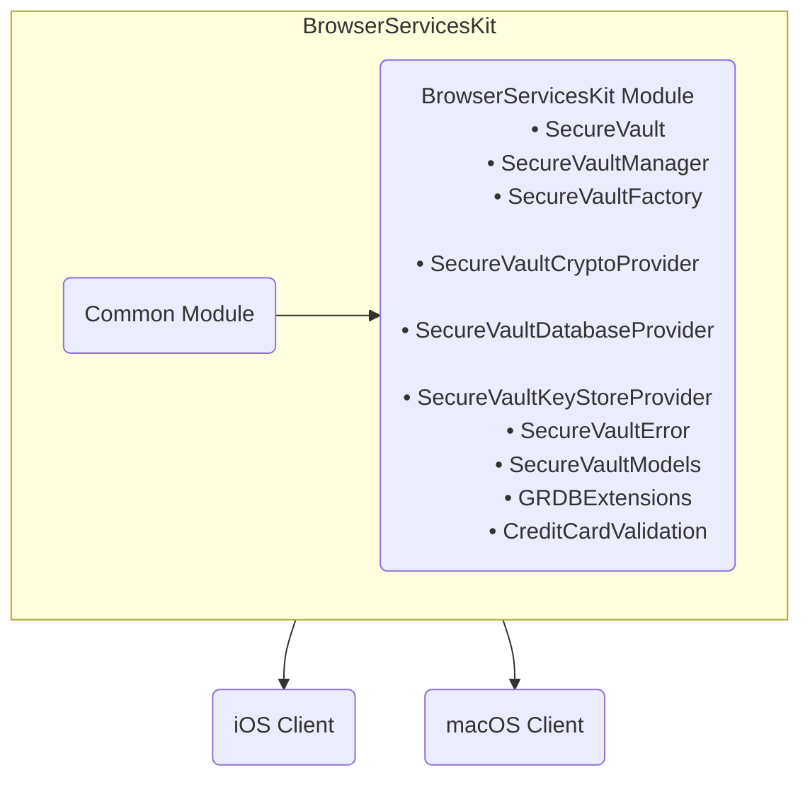
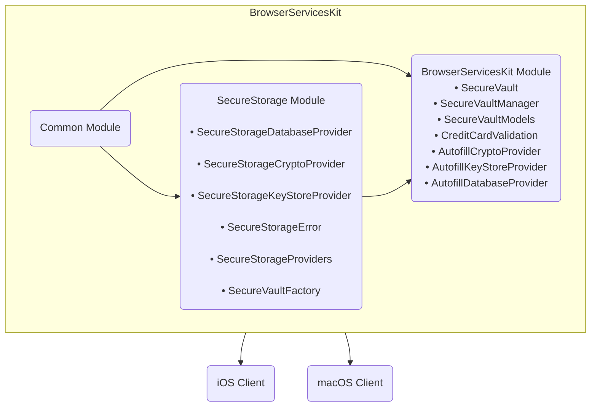

# Secure Vault Restructuring Notes

### Before

```mermaid
flowchart TD

    subgraph BrowserServicesKit
        common(Common Module)
        bsk("BrowserServicesKit Module
             • SecureVault
             • SecureVaultManager
             • SecureVaultFactory
             • SecureVaultCryptoProvider
             • SecureVaultDatabaseProvider
             • SecureVaultKeyStoreProvider
             • SecureVaultError
             • SecureVaultModels
             • GRDBExtensions
             • CreditCardValidation")

        common --> bsk
    end

    ios(iOS Client)
    macos(macOS Client)

    BrowserServicesKit --> ios
    BrowserServicesKit --> macos
```

### After

```mermaid
flowchart TD

    subgraph BrowserServicesKit
        common(Common Module)

        securestorage("SecureStorage Module
                       • SecureStorageDatabaseProvider
                       • SecureStorageCryptoProvider
                       • SecureStorageKeyStoreProvider
                       • SecureStorageError
                       • SecureStorageProviders
                       • SecureVaultFactory")

        bsk("BrowserServicesKit Module
             • SecureVault
             • SecureVaultManager
             • SecureVaultModels
             • CreditCardValidation
             • AutofillCryptoProvider
             • AutofillKeyStoreProvider
             • AutofillDatabaseProvider")

        common --> bsk
        common --> securestorage
        securestorage --> bsk
    end

    ios(iOS Client)
    macos(macOS Client)

    BrowserServicesKit --> ios
    BrowserServicesKit --> macos
```
